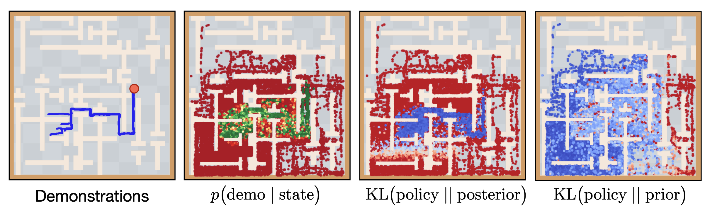
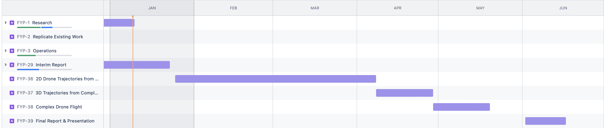

# Agile Trajectory Generation for Tensile Perching with Aerial Robots

---
# Progress Update
### Demonstration Guided Reinforcement Learning with Learned Skills
- Prior Approaches
  - Attempt to follow the demonstrations step by step → Slower Learning
  - New behaviours are not completely unseen - they share subtasks

- Approach
  - Learn a large set of reusable skills from large offline datasets of prior experience collected across many tasks.
  - Skill Based Learning with Demonstrations - an algorithm for demonstration guided RL that levelerages the provided demonstrations by following the demonstrated skills instead of the primitive actions

---

---
### Forgetful Experience Replay in Hierarchical Reinforcement Learning from Expert Demonstrations
- ForgER algorithm for hierarchical RL, using low-quality demonstrations in complex environments with multiple goals.
- Automatic highlighting of sub-goals in complex tasks improving learning efficiency.
- Control over how "forgetful" the system is. In more unreliable examples the experiences can be

---
### Mapless Navigation for UAVs via Reinforcement Learning from Demonstrations
- Soft Actor Critic from Demonstrations
- Presents an algorithm for Navigation - based on sensor readings from obstacles
- This allowed learning even when obstacles were moved
- Gives background for perch based coordinate system

---
### Inverse Reinforcement Learning Control for Trajectory Tracking of a Multirotor UAV
- Learn the control performance of an expert by imitation demonstrations of a UAV operated by an expert pilot.
- From 7 demonstrations follow a figure of 8 style path.
- Learn the Reward function to achieve this
- Input data in demonstrations is assumed to be optimal 
  - therefore the paper focusses on mimicking rather than improving on the trajectories.

---
# General Plans
- Focused on Demonstration Guided Reinforcment Learning with Skills
  - Demonstrations: Using a small number of demonstrations of the specific skill e.g. contact/wrapping, flipping over, recovery.
  - Skills: General flight data from drones - either from existing data or explore what we can get from simulation.

---
# Project Plan - 22 Weeks
- (2 Weeks) Until 24th Jan
  - Interim Report (Introduction, Background, Project Plan, Evaluation Plan, Ethical Discussion)
  - Understanding the data that is currently available and what will need to be collected etc in order to adjust plans for time needed for this collection.
- (6 Weeks) Spring Term (until 6th March)
  - Aim: Generate 2D trajectories for a perching drone for the 3 stages: Contact/Wrapping, Flipping Over, Recovery.
  - 2D Implementation of system (Straightforward Drone with weight on string)
  - Proof of Concept using Flight Data as Skills with a Limited Number of Demonstrations
- (2 Weeks) Break for Spring Term Exams - from here onwards work on this is full-time.

---
- (2 Weeks) 25th March - 7th April
  - As before - 2D Implementation
- (3 Weeks) 8th April - 28th April
  - Aim: Generate 3D trajectories from more complex demonstrations such as figure of 8 style wrapping.
- (3 Weeks) 29th April - 19th May
  - Aim: Generate trajectories for more complex drones that are currently difficult for human pilots i.e. TUM
- (2 Weeks) 20th May - 2nd June
  - Buffer time for potential issues
- (2 Weeks) 2nd June - 16th June
  - Finalise Report and Presentation

---

---
# Evaluation Plan
- Successful Attempts
- Energy Consumption

- Main area that I need to think more about and understand.

---
# Plans Until Next
- Largely be focussed on the Interim Deadline for the next 2 weeks

---
# Questions
- Background: Level of expectation of understanding of readers?
  - i.e. should I expect understanding of RL? understanding of drone movements?
- Feedback on Project Plan
- What makes a good evaluation? Should I be comparing to an existing system?
- What data is available at the moment?