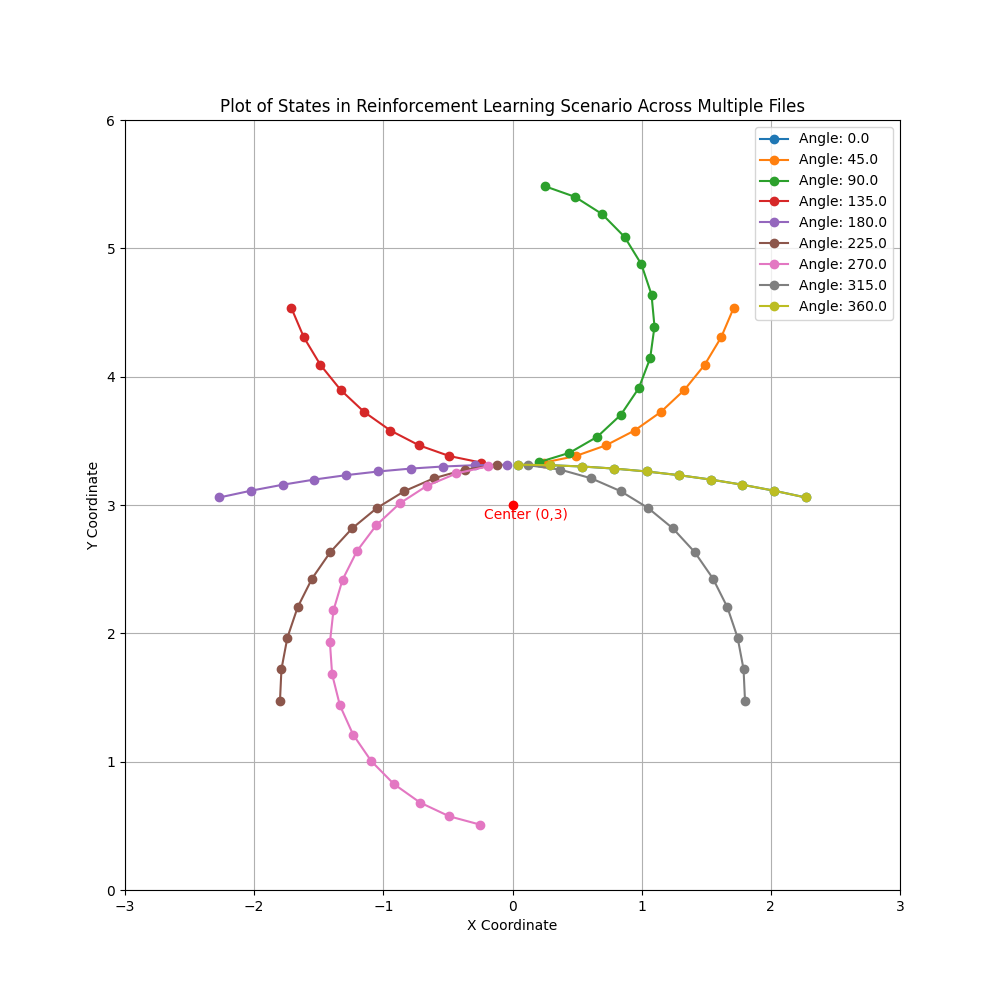

# Agile Trajectory Generation for Tensile Perching with Aerial Robots

---
# Progress Update
- Previous Demos
  - Generated a set of demonstrations
  - Converted them match the 2-level waypoint system
- Optimised Demos
  - Generated a set of demonstrations
  - Converted them match the 2-level waypoint system
- Reward = - distance to branch

- Trained Base Algorithm (without demonstrations)
  - Show this
- Adapted 

---

---

---

---
# From previous update
- Run on current data
  - Demonstrations
    - Hann
      - Generate a set of optimised trajectories from Hann's code. - Done
- Learning from Demonstrations
    - Currently priming the replay buffer with the demonstration data.
    - True algorithm maintains two different buffers and produces different updates. - Done - Cancelled training as I want to fix issues from baseline system.

- Two Level System
    - TODO
    - Using curves for waypoints.
    - Tuning the maximum distance between waypoints.

---
# Next Steps
- Issues faced
  - Resetting
  - Reward Function 
    - done based on hitting tether to branch.
    - collision - penalise contact between drone and branch.
    - Trajectory Smoothness Term
- Learning from Demonstrations System
- By next week: Approaching stage finished with comparison results between SAC and SACfD.
