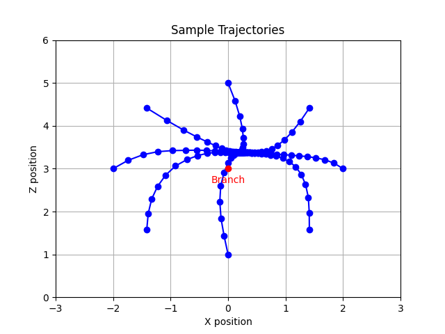

# Agile Trajectory Generation for Tensile Perching with Aerial Robots

---
# Progress Update
- Demonstrations
  - Meeting with Atar on Friday to discuss demonstrations

---
# From Previously
- Further Statistics on the training
  - Normalisation issue in the training data - where I hadn't applied the same normalisation to the demonstrations as I had in training.
- Reward Function
- Smoothness
  - Already a smoothness term which can be seen in easy tasks.
  - Introduce Prioritised Experience Replay to help combat the harder learning portions.
  - Sampling learnable parameter.
- Move onto next stage:
  - Wrapping

---
# Reward
- Discussed last time about the level of tuning of reward function and whether that's what the right direction.

- Massively simplified the reward function
\+ Distance to branch
\-  Hitting branch
\+ Wrapping

- Outcome
  - Without demonstrations - taking roughly 4-5x as long to reach a "good" point in training.
  - With demonstrations - 1.2-1.3x number of steps.

---
# Wrapping Phase
- Currently achieving mixed results. From one direction, the wrapping seems to work. But from the other it struggles.

- Demo

---

---
# Next Steps
- Augment State Space with "directional" knowlege
  - Starting position in state space
  - Previous n states

- Hanging Phase