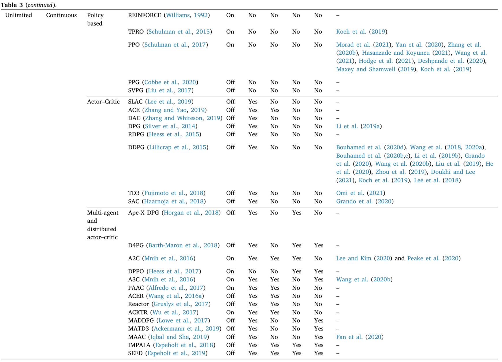

# Agile Trajectory Generation for Tensile Perching with Aerial Robots
### Current Issues
- Approaching/Wrapping
  - Tether hitting itself
  - Novel Trajectories - Figure of 8
- Wrapping
  - 100g Weight leads to a 12% reuction in flight time
- Taking-off phase from the upside-down stage of the drone

---
# Progress Update

## Deep Q Learning
### `Human-Level Control through Deep Reinforcement Learning`
- Trained a NN to estimate the Q Function.  <!-- gamma=0.99 -->
- Frame rates comparable to human reaction. <!-- They used 10Hz for a game. This idea could come up in Drone Control too. -->
- Experience Replay - potentially link of experience replay with different envs: `An Application of Reinforcement Learning to Aerobatic Helicopter Flight` <!-- Aviods potentially catestrophic feedback loops. Memory buffer doesn't differentiate important transitions and instead always overwrites with recent transitions - this could be changed if there were differences in importance perhaps? anyone tried this? prioritised sweeping? -->
---
### `Deep Q-Learning from Demonstrations`
- Small sets of training data to massively accelerate the learning.
- Motivated by the lack of real-world simulators for many tasks.
- Replay buffer - demonstration-data is never overwritten.
- Loss functions - 1-Step souble Q-Learning Loss, N-Step Q-Learning Loss, Supervised Large Margin Clasification Loss, L2 Regularization Loss.
- Future Direction - Apply these concepts to domains with continuous actions where the classification loss becomes a regression loss.
---
## SAC
### `Soft Actor-Critic with Inhibitory Networks for Retraining UAV Controllers Faster`
- Traditional SAC for retraining a policy can lead to catastrophic forgetting of the policy's known skills.
- Proposes SAC with Inhibitory Networks
- Transfer Learning - combining multipe skils/training within different environments

---
## General
### `Autonomous Unmanned Aerial Vehicle Navigation using Reinforcement Learning: A Systematic Review (2022)`
- Survey consisting of 159 papers in UAV + Reinforcement Learning
  - ~30 were directly related to Path Planning
  - Energy-Aware UAV Navigation
- Further Papers
  - Path Planning Frameworks
  - Transfer Learning Frameworks
- Simulation Software - Gazebo & ROS, AirSim & Unreal Engine
----

---
## Practical
### Reproducing Code Results
- Began to look through previous work.
  - Taking longer than anticipanted to fully understand.
### Gazebo
- Gazebo Setup
  - Currently struggling with setting up the environment.

---
# General Plans
- Literature
  - Many different areas to explore.
- Practical
  - Behind where I had initially anticipated.
  - Want to dedicte more time over the next week towards this.

---
# Plans Until Next

<!-- _class: split -->

#### Literature
- Explore different models presented in the Systematic Review.

#### Practical
- Dedicate more time over the next week.
- Aim to have the enviornment set to be able run previous work.

---
# Feedback
- Trtadynamics - complex in physics based experiments
  - Use data from experiments
  - Share some of that data
  - Alan Thesis
  - Possibility on device
  - Cases for use of learning from demonstration
- Aero Robotics Labs
- Clearer Understanding of the problem