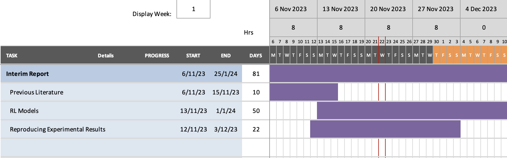

# Agile Trajectory Generation for Tensile Perching with Aerial Robots
- Generate trajectories for the aerial robot to perch on the tree branch using a tethered perching mechanism with a pendulum like structure.

---
# Progress Update
- Dedicate more time over the next week.
- Aim to have the enviornment set to be able run previous work.
### Practical
- Successfully have the environment running. Have 2 versions:
  - VM: Set up a vm to have previous year experiments running.
  - Docker: Containerised version. Can run a particular trajectory and return the flight information.

---
### Meeting with Tian
- System involving a drone, with a payload attached via a tether.
  - Payload has 2 blades allowing it to move.
  - Current attaching motion involves flying the 2 sections in opposite directions over a branch.
- Complexity in piloting due to the complicated pendulum motion.
- Currently hard even for experienced pilots.
- Potential for Reinforcment Learning to be used.

---
# General Plans
- Achieved planned aim around reproducing practical results.
- Want to focus towards literature around demonstration reinforcment learning.

---
# Plans Until Next
- Literature
  - Alan Slatter Thesis
  - `Autonomous Unmanned Aerial Vehicle Navigation using Reinforcement Learning: A Systematic Review (2022)`
    - Review paper presented last week. Following this up with reading relevant research papers from this review focussing towards Demonstration Reinforcement Learning.
  - `Tethered Unmanned Aerial Vehicles—A Systematic Review (Aug 2023)`
    - A very recent review, not focussed on Reinformcent Learning in particular. But does review several papers involving RL.
- Practical
  - Investigate potential for simulation environments for pendulum like structures.
---
# Questions
- What data can be collected during demonstration flight.
  - Sensors on drones
  - Images/Cameras
  - x,y,z, altitutde: raw, pitch, yaw. Add markers to payload to also

---
# Feedback
- Approaching: Represent pendulum with assumption around velocity then it will definetly wrap the structure. If it reaches the terminal velocity.
- 