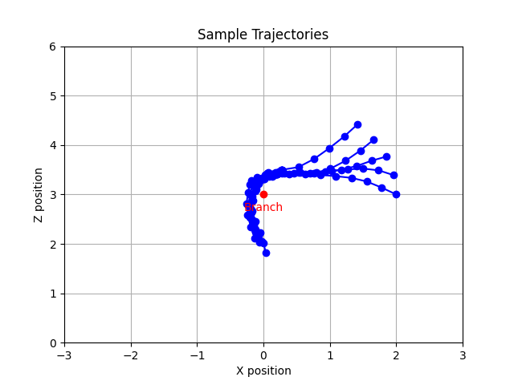

# Agile Trajectory Generation for Tensile Perching with Aerial Robots

---
# Progress Update
- Demonstrations
  - Recorded all demonstrations
  - Integrated into the training
  - Results are strong (20%-40% improvement time to perch)

---
# From Previously
- Issue around wrapping from different sides.
  - Starting position in state space
  - Previous n states
  - Discussion last time.
    - Take advantage of the symmetry in the environment.
    - More mathematical information on the Reward Function.

---
# Symmetry
We can assume symmetry across the x=0 plane i.e. from either approaching side of the branch.

Symmetrical Wrapper
- Takes in the positions and actions and converts the positions to be +ve with respect to the starting position.
- Making the problem easier to solve by only needing to learn from one side.
- Implemented as a Gym Wrapper so that it is easy to add/remove to compare the learning effects.

---
### Symmetry Diagram

<!-- ---
### Symmetric Tragectories -->
---
# Reward Function
Reward is currently calculated in levels: 
- Approaching: $r_1 = - dist(x_{state}; a_{target})$

- Wrapping: $r_2 = num\_wraps(x)$

- Hanging: $r_3 = max(1 \text{ if } within(x_{state}; h_{box} \text{ else } 0), - dist(x_{state}; h_{target})  )$

- Overall:

  - If num_wraps > 1:
    - $r = scale(r_3; -1, 0)$

  - Otherwise:
    - $r = scale(r_2 + r_1; -3, 0)$ otherwise

---
# Further Mathematics
- Distance: $dist(x, target) =  norm_{L2}(x, target)$
- Number of Wraps: Algorithm on next slide - based around the position of the two ends of the tether - tracking through different timesteps to calculate rotation.
- Scale: $scale(x; min_x, max_x, a, b) = ((x - min_x) / (max_x - min_x) \text{ x } (b - a))$

---
# Num Wraps

# Hanging Reward Visual

---
Trajectory

---
# Gazebo Integration
- Built a controller than can follow the waypoints

Todo:
- Integrate the Spline portion.
- Fix a bug with the plotting.

Show Demo
---
# Report Plan
- Main Contributions
  - PyBullet Simulation to model simulation dynamics.
  - Learning from Demonstrations Integrations.
  - Set of Produced Trajectories optimised for speed.
  - Controller for Gazebo based on fixed time movement waypoints.
---
Main Deatils to move forward
- Notion taking away from message
  - Starting point
  - Operation Success
  - Realtime easier to work out
  - Operation success message - 
- Experimental

# Report Plan
- Intro - Background
- Methodology
  - Environmental Modelling
    - Initial Environment
      - Pybullet Environment
      - Tether Modelling
    - Wrappers and Effects
      - Dimension
      - Symmetry
      - Memory
      - Timestep
  - Training
    - Reward Function Design
    - Algorithms
    - Demonstrations - Comparison of different training techniques.
---
- Results
  - Trajectory Experiments
  - Speed
- Conclusion

---
# Report Content
- Setup seperate git repository for report.
- Added in an outline.
- Gathered the ideas and have created tickets for each section with a better description of what I want to show and how I'm going to show it.

- Linked to Overleaf for external viewing.

Overleaf: https://tinyurl.com/TommyMengThesis
(Will send in email)

---
# TODO
- Gazebo
  - Integrate with Spline curves to match waypoint navigation in pybullet.
  - Fix bug in plotting diagram code for "true trajectory"
- Training
  - Hyper-parameter tuning
  - Produce final set of trajectories
- Experiement - To discuss
- Report

---
# Overall Plan
- Report Deadline 17th June (2.5 weeks)
  - Week 27th May - 3rd June  ----- Gazebo, Hyper-parameters, Final Trajectories
  - Week 3rd - 10th June ---------- Evaluation, Experiments, Report
  - Week 10th - 17th June -------- Report
